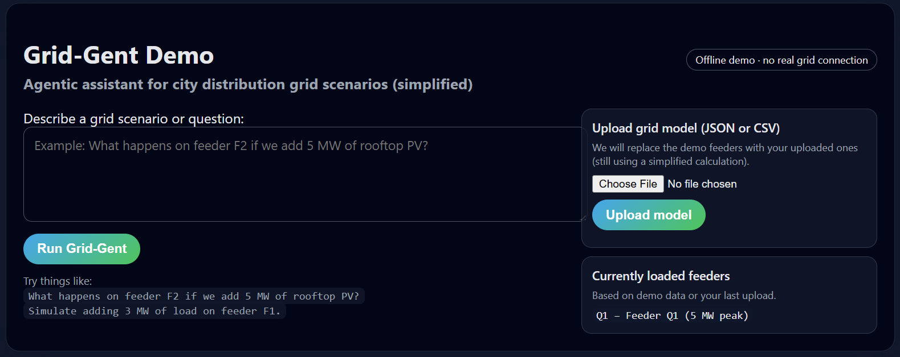

# Grid-Gent Demo (v4) – Uploadable Grid Models

Agentic-style assistant for city distribution grid scenarios with:

- Unknown/smalltalk handling (no fake scenarios for 'hi', 'why', etc.).
- Conceptual explanation mode when no feeder/MW is given.
- Scenario mode (simulation / hosting_capacity) for actual what-if questions.
- **New:** Upload your own grid model (JSON or CSV) and the demo will use it.




👉 **Live demo on Hugging Face Spaces:**  
https://huggingface.co/spaces/jamesafful/grid-gent


## Running

```bash
python main.py
```

Then open http://localhost:8000.

On the right side of the UI you can upload a `.json` or `.csv` file with feeder definitions.
The server will replace the built-in demo feeders with your uploaded ones (still using a simplified
calculation, not a full AC power flow).


## Background: Why Lightweight Grid Scenario Screening Tools Matter

### Can Utilities Benefit from Lightweight Tools for Early-Stage Grid Scenario Screening?

“Can this feeder handle 1.5 MW of new load?”  
“What if we add a rooftop solar portfolio in this neighborhood?”

Utility planning engineers are asked variations of these questions constantly. They seem simple, but they come from developers, facility managers, municipalities, and internal stakeholders who simply want to understand what is possible on the distribution grid.

Today, many utilities still rely on the same sophisticated processes used for full-scale planning studies to answer these early-stage questions. It’s often like killing a fly with a missile. This workflow mismatch has quietly become one of the least-discussed bottlenecks in distribution planning, despite the wide range of modeling tools utilities already maintain.

Technologies driving the energy transition—EV charging clusters, distributed solar, data centers, campus loads—create a surge of exploratory inquiries long before a formal interconnection request is filed. This was predictable, and it highlights the need for a middle layer between “no analysis” and “full analysis.”

Lightweight, reasonably accurate early-stage scenario screening could help triage straightforward questions before escalating them to deeper engineering study, reducing unnecessary load on specialists.

### What Should This Early-Stage Screening Tool Look Like?

An effective early-stage screening tool should:

- Translate everyday language into structured parameters a planner can validate.
- Provide quick approximations of peak loading, hosting capacity, and voltage sensitivities.
- Be transparent—planners must be able to see and correct the assumptions.
- Avoid black-box behavior; interpretability is essential.

### The Risks of Ignoring This Problem

If every inquiry is treated as a full-scale study:

- Interconnection backlogs will continue to grow.
- Developers will lose confidence in utility response times.
- Electrification and modernization goals will keep slipping.

Ironically, many delays stem from tasks requiring structured reasoning, not deep physics.

### A Path Forward

Agentic Artificial Intelligence (Agentic AI) may serve as this missing early-stage screening layer. A well-designed agentic system can plan a task, reason through assumptions, execute the steps needed for an approximate assessment, and present the results transparently.

Grid-Gent (https://github.com/jamesafful/grid-gent) is one example of an experimental assistant for grid scenario exploration. It enables planners and developers to test multiple scenarios on a simplified feeder model, without invoking a full power flow engine.

### Conclusion

Given the accelerating pace of the energy transition, modern planning workflows need dependable, lightweight tools that complement—not replace—rigorous engineering. Early-stage screening can help utilities respond faster, reduce bottlenecks, and improve overall planning efficiency.
